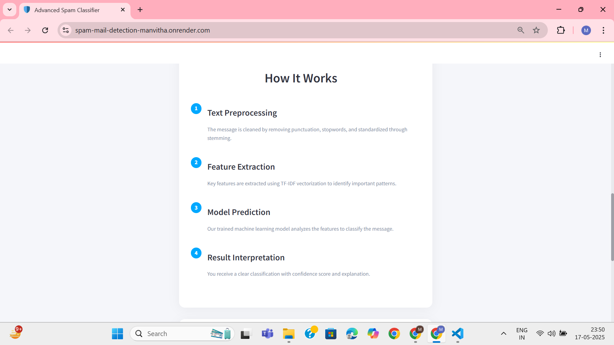
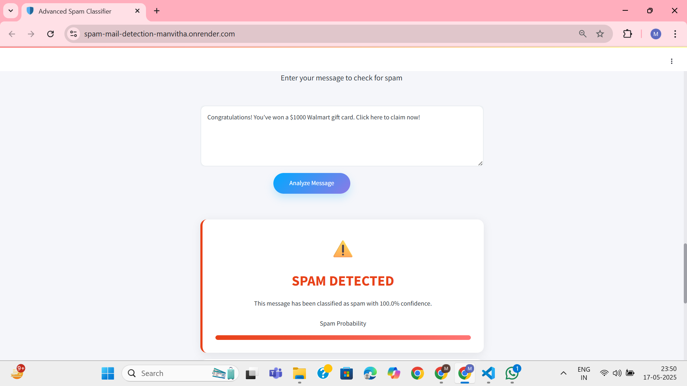

# 📧 Spam Mail Detection

A machine learning-based web application that classifies emails as **Spam** or **Ham** (Not Spam) using Natural Language Processing (NLP) techniques and a trained model. Built with Python and deployed using Streamlit, this tool provides an intuitive interface for real-time spam detection.

---

## 📝 Introduction

Email spam poses significant challenges in digital communication, leading to security risks and reduced productivity. This project aims to automate the detection of spam emails by analyzing their content and identifying patterns indicative of spam.

---

## 📄 Abstract

The Spam Mail Detection system leverages NLP and machine learning to distinguish between spam and legitimate emails. By training on a labeled dataset, the model learns to recognize common characteristics of spam messages, enabling efficient and accurate classification.

---

## ✨ Features

- **Real-time Classification**: Input email content and receive immediate spam or ham classification.
- **User-friendly Interface**: Simple and intuitive UI built with Streamlit.
- **Model Persistence**: Utilizes serialized models (`model.pkl` and `vectorizer.pkl`) for quick loading and prediction.
- **Dataset Included**: Comes with a preprocessed dataset (`spam.csv`) for training and evaluation.

---

## 🖼️ Screenshots





---

## 🌐 Live Demo

Experience the application live at:  
👉 [https://spam-mail-detection-manvitha.onrender.com](https://spam-mail-detection-manvitha.onrender.com)

---

## 🛠️ Tech Stack

- **Programming Language**: Python
- **Libraries**:
  - `pandas`
  - `numpy`
  - `scikit-learn`
  - `nltk`
  - `streamlit`
- **Model Serialization**: `pickle`
- **Deployment**: Streamlit on Render

---

## 🧠 Approach

1. **Data Collection**: Utilized the `spam.csv` dataset containing labeled email messages.
2. **Preprocessing**:
   - Removed unnecessary characters and stopwords.
   - Applied stemming using NLTK's `PorterStemmer`.
3. **Feature Extraction**: Converted text data into numerical features using `CountVectorizer`.
4. **Model Training**: Trained a machine learning model (e.g., Naive Bayes) on the processed data.
5. **Model Serialization**: Saved the trained model and vectorizer using `pickle` for later use.
6. **Web Interface**: Developed a Streamlit app (`app.py`) to interact with the model.

---

## ⬇️ Cloning the Repository

```bash
git clone https://github.com/ManvithaPola/Spam-Mail-Detection.git
cd Spam-Mail-Detection
```
## 🚀 Running the Application

### 📦 Install Dependencies

```bash
pip install -r requirements.txt
```
## ▶️ Run the Streamlit App

```bash
streamlit run app.py
```

---

## 🔮 Future Enhancements

- **Enhanced Model Accuracy**: Experiment with advanced algorithms like Support Vector Machines (SVM) or ensemble learning methods to improve prediction accuracy.
- **Email Integration**: Connect the system directly with email services (like Gmail or Outlook) to scan and filter incoming emails in real time.
- **User Feedback Loop**: Add functionality to collect user feedback on predictions, allowing the model to learn and improve dynamically.
- **Mobile Compatibility**: Design a responsive UI or develop a mobile app version for better usability on smartphones and tablets.
- **Multilingual Support**: Extend the system to support spam detection in emails written in languages other than English.
